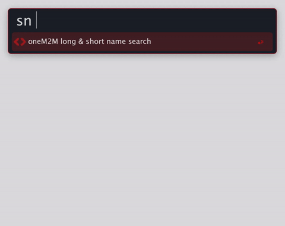

# Alfred Workflow - Find oneM2M Short Names 

This Alfred workflow provides a search for oneM2M attribute long and short names.


## Installation & Maintenance

### External Tools
- **jq - Command line JSON processor**  
The workflow requires the [jq](https://stedolan.github.io/jq/) command line JSON processor. You need to install it separately, for example via brew (see [https://formulae.brew.sh/formula/jq](https://formulae.brew.sh/formula/jq)).

      brew install jq

### Updating the JSON Attributes File

The attribute mappings and information are located in the file *attributes.js* in the workflow directory. An updated version can be generated by using the script from the [oneM2M_TS-0004_def_extractor](https://github.com/IoTKETI/oneM2M_TS-0004_def_extractor) project.


## Usage

Keyword trigger in Alfred: ```sn```

Pressing ```return``` copies both the long and the short name to the clipboard.


## Roadmap

- Add <flexContainer> specializations from TS-0023